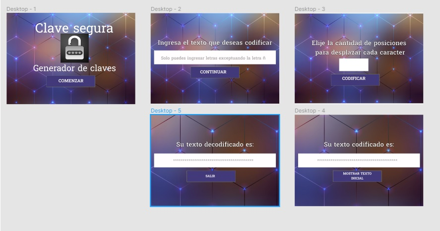

# CIPHER
## Proceso y decisiones de diseño
Para realizar el proyecto Cipher inicialmente se realizó un prototipo en figma como se muestra a continuación  

[Link para ver el prototipo en figma] (https://www.figma.com/file/NQPOf80CyZ7YpHb7bfgdHo/Untitled?node-id=0%3A1)  

Conforme se avanzó en la implementación del proyecto se fueron realizando ciertos cambios, tales como:
1. Inicialmente se pensaba presentar en dos pantallas diferentes los inputs para el ingreso del texto y el desplazamiento de los caracteres, pero durante la implementación se decidió hacerlo en una sola ventana para mejor funcionalidad.
2. Se agregó una ventana para dar una breve explicación al usuario de la funcionalidad del programa.

## ¿A quién está dirigido?
Cipher fue diseñado para personas que necesiten generar claves seguras para sus diferentes accesos según requerieran, a partir de frases simples que normalmente no sería seguro establecer como contraseña.

## Utilidad
En muchas ocasiones, las personas no tienen facilidad de establecer contraseñas seguras que sean fáciles de recordar, normalmente utilizan fechas especiales (la mayoría suele utilizar su feha de nacimiento) o cualquier información personal que sería fácilmente descubierta por una persona que tenga algo de conocimiento de esta información, es por ello que por medio del uso de Cipher se ofrece la codificación de una frase cualquiera fácil de recordar por el usuario, pero que, por medio de un patrón de cifrado dado a conocer previamente, genera una nueva frase con caracteres diferentes.   
